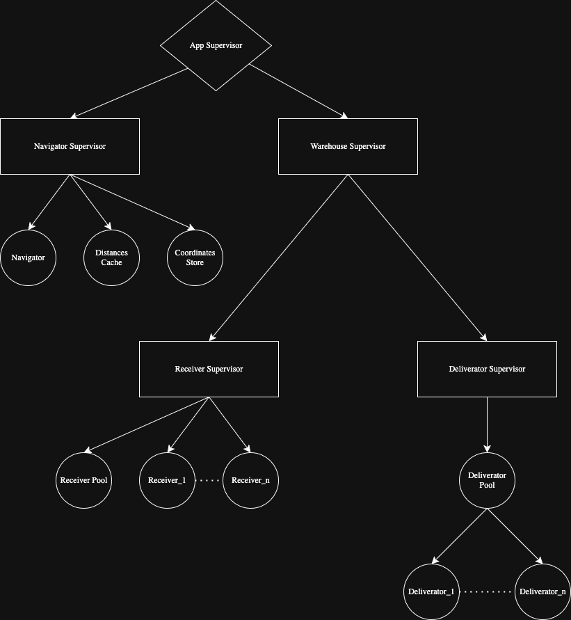

# Cosanostra Delivery

This project simulates a delivery system built with Gleam and the OTP framework. It models core components as actors, including package management, deliverators, and navigation. The system implements two concurrency patterns:

- **Dynamic pool pattern:** Receivers are dynamically started and stopped as needed, with a configurable maximum to prevent resource exhaustion.
- **Static pool pattern:** Deliverators are started with a defined count, assigned unique names, and their restarts are tracked. Reincarnated deliverators retain their original names, preserving links defined in the supervision tree at start up.


## Supervision Tree




## Sequence Pseudocode
A text-based pseudocode representation of the sequence diagrams for the main actors, illustrating their interactions and workflows.


### Receiver Pool

```
receiver_pool_sequence
    actor A as Client
    actor B as ReceiverPool
    actor C as Receiver (Worker)
    actor D as Navigator
    actor E as DistancesCache
    actor F as CoordinatesStore
    actor G as DeliveratorPool

    A->>B: receive_packages(packages)    
        B->>B: Checks memoization table
        alt Batch is not memoized
            B->>C: Spawns new Receiver
            C->>B: process is unlinked and monitored 
            B->>C: calculate_shortest_path(batch)
            activate C
                C->>D: get_distance(from, to)
                activate D
                    D->>E: get_distance(from, to)
                    E-->>D: returns distance
                    alt If cache is a miss
                        D->>F: get_coordinates(from)
                        F-->>D: returns coordinates
                        D->>F: get_coordinates(to)
                        F-->>D: returns coordinates
                    end
                    D-->>C: returns calculated distance
                deactivate D
                C-->>B: path_computed_success(shipment)
            deactivate C
            B->>B: Updates memoization table
        end
        B->>G: receive_packets(shipment)
    deactivate B
```

### Navigator

```
navigator_sequence
    actor A as Client (e.g., Receiver)
    actor B as Navigator
    actor C as DistancesCache
    actor D as CoordinatesStore

    A->>B: get_distance(from, to)
    activate B
        B->>C: get_distance(from, to)
        activate C
            C-->>B: returns Result(Float, Nil)
        deactivate C
        alt Cache is a hit (Ok(dist))
            B->>B: Returns cached distance
        else Cache is a miss (Error(Nil))
            B->>D: get_coordinates(from)
            activate D
                D-->>B: returns coordinates
            deactivate D
            B->>D: get_coordinates(to)
            activate D
                D-->>B: returns coordinates
            deactivate D
            B->>B: Calculates new distance
        end
        B-->>A: returns final distance
    deactivate B
```

### Deliverator Pool

```
deliverator_pool_sequence
    actor A as Client
    actor B as DeliveratorPool
    actor C as Deliverator (Worker)

    A->>B: receive_packets(batch)
    activate B
        B->>B: Checks for available Deliverators
        alt If a Deliverator is Idle
            B->>C: deliver_packets(batch)
            activate C
                loop for each packet in batch
                    C->>C: Simulates delivery
                    C->>B: packet_delivered(packet)
                    activate B
                        B->>B: Removes packet from Deliverator's list
                    deactivate B
                end
                C->>B: deliverator_success()
            deactivate C
            B->>B: Marks Deliverator as Idle
        end
    deactivate B
```

## Development

```sh
gleam run   # Run the project
gleam test  # Run the tests
```
