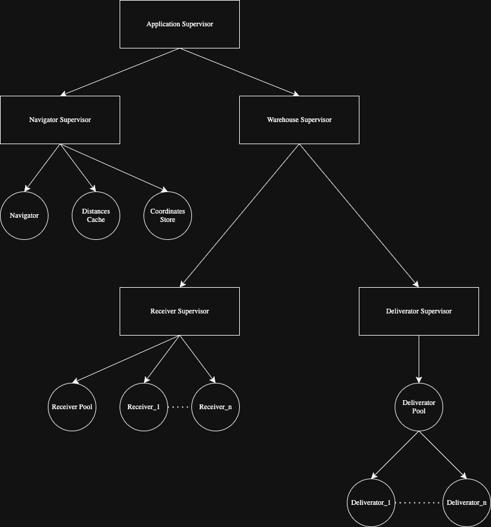

# Cosanostra Delivery

This project simulates a delivery system built with Gleam and the OTP framework. It models core components as actors, including package management, deliverators, and navigation. The system leverages two concurrency patterns:

- **Dynamic pool pattern:** Receivers are dynamically started and stopped as needed, with a configurable maximum to prevent resource exhaustion.
- **Static pool pattern:** Deliverators are started with a defined count, assigned unique names, and their restarts are tracked. Reincarnated deliverators retain their original subjects, preserving links defined in the supervision tree.




## Development

```sh
gleam run   # Run the project
gleam test  # Run the tests
```
